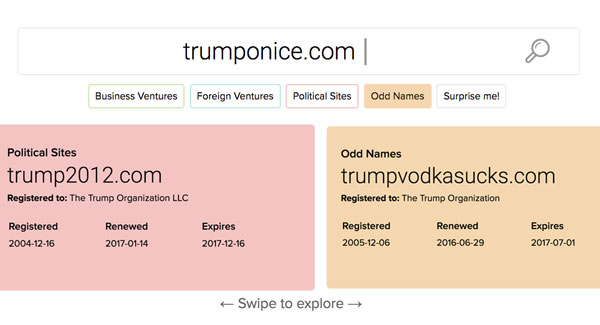

# interactive_trump-urls

| Title | Trump’s future business plans may be hiding in plain sight |
|-|-|
| Developer    | [Tyler Fisher](tfisher@politico.com) |
| Link | [http://www.politico.com/interactives/2017/trump-organization-business-domain-names-vegas-moscow/](http://www.politico.com/interactives/2017/trump-organization-business-domain-names-vegas-moscow/) |

## Assumptions

- You are running the latest version of Mac OS X.
- You have Node.js and Yarn installed.
- You have POLITICO's AWS credentials stored locally.
- You have installed [POLITICO's interactive generator](http://generator-politico-interactives.readthedocs.io/en/latest/).

## Bootstrap the project

```
git clone https://github.com/The-Politico/interactive_trump-urls.git
yarn
gulp
```

## Publish the project

```
gulp publish
```

## Helpful links

- [URL data](https://github.com/The-Politico/interactive_trump-urls/blob/master/dist/data/cards.json)
- [Generator docs](http://generator-politico-interactives.readthedocs.io/en/latest/)

©2017 POLITICO
